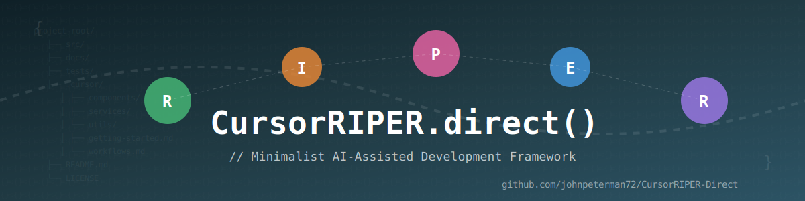
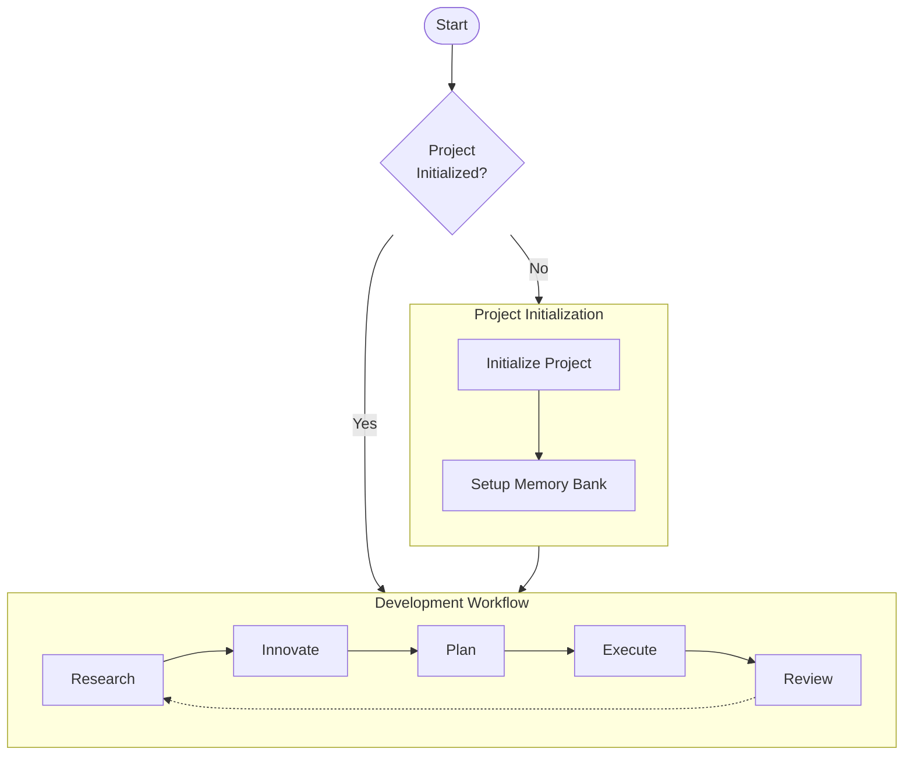

# CursorRIPER Direct

A streamlined, task-oriented framework for AI-assisted software development in Cursor IDE.

## Overview

CursorRIPER Direct (CRD) provides a minimalist approach to the RIPER methodology, focusing on developer workflows rather than framework components. The framework guides you through five key development activities:

1. **Research**: Information gathering and understanding existing code
2. **Innovate**: Brainstorming potential approaches and solutions
3. **Plan**: Creating detailed technical specifications
4. **Execute**: Implementing approved plans with precision
5. **Review**: Validating implementation against plans



## Key Features

- **Task-Oriented**: Organized around how developers work
- **Minimalist**: Fewer files, less rigid structure, easier to maintain
- **Native Integration**: Works with Cursor's built-in features
- **Visual Documentation**: Incorporates diagrams and clear visuals
- **Progressive Detail**: Starts simple, adds detail only when needed

## Getting Started

1. Copy the framework files to your project:
   ```bash
   cp -r src/.cursor your-project/.cursor
   ```

2. Create your memory bank:
   ```bash
   mkdir -p memory-bank
   cp -r src/templates/memory-bank/* memory-bank/
   ```

3. Initialize your project information in the memory bank files

4. Start using the RIPER workflow for your development

## Documentation

- [Getting Started](docs/getting-started.md)
- [Workflows](docs/workflows.md)
- [Reference](docs/reference.md)

## License

This project is licensed under the MIT License - see the LICENSE file for details.

---
The orginial RIPER framework is by: [robotlovehuman](https://github.com/robotlovehuman)


*CursorRIPER Direct: Minimal framework, maximum productivity.*
