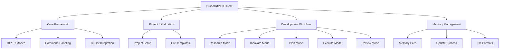
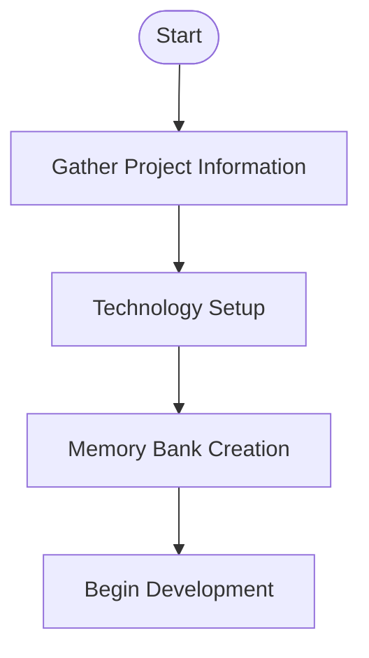
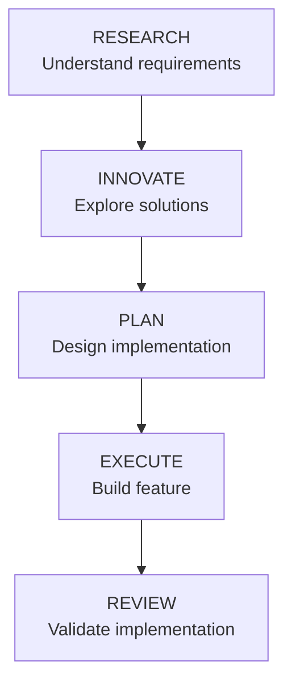
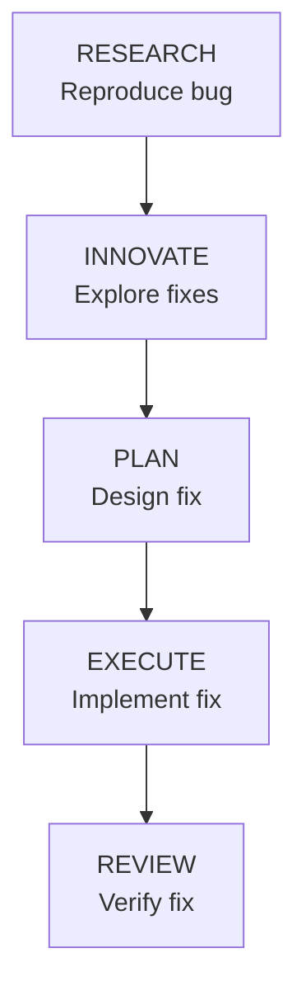
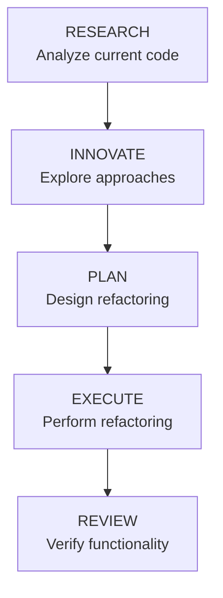

# CursorRIPER Direct - Reference Guide

This comprehensive reference guide provides detailed information about all aspects of the CursorRIPER Direct framework.

## Framework Components



## Core Framework

### Framework Files

CursorRIPER Direct consists of these core files:

| File | Purpose |
|------|---------|
| `cursor-riper.mdc` | Core framework functionality and mode definitions |
| `project-initialization.mdc` | Project setup process |
| `development-workflow.mdc` | RIPER workflow implementation |
| `memory-management.mdc` | Memory bank management procedures |

### Supported Commands

| Command | Shorthand | Purpose |
|---------|-----------|---------|
| `ENTER RESEARCH MODE` | `/research` | Switch to RESEARCH mode |
| `ENTER INNOVATE MODE` | `/innovate` | Switch to INNOVATE mode |
| `ENTER PLAN MODE` | `/plan` | Switch to PLAN mode |
| `ENTER EXECUTE MODE` | `/execute` | Switch to EXECUTE mode |
| `ENTER REVIEW MODE` | `/review` | Switch to REVIEW mode |
| `INITIALIZE PROJECT` | `/init` | Begin project initialization |

### Cursor Integration

CursorRIPER Direct integrates with Cursor IDE through:

1. **Rules Directory**: Files in `.cursor/rules/` directory
2. **Chat Commands**: Commands processed in Cursor's chat interface
3. **Memory Files**: Plain markdown files in the memory-bank directory

#### Custom Modes (Optional)

CursorRIPER Direct can optionally leverage Cursor's Custom Modes feature:

1. Enable Custom Modes in Cursor settings
2. Create modes matching the RIPER workflow
3. Configure appropriate tools for each mode
4. Use custom instructions to enforce mode behaviors

## RIPER Modes Reference

### RESEARCH Mode

**Purpose**: Information gathering and understanding existing code.

**Prompt Examples**:
- "How does the login system work in this codebase?"
- "Help me understand the data flow in this component."
- "Explain the architecture of this application."
- "What technologies and frameworks are being used?"

**Behavior**:
- Focuses only on understanding, not suggesting changes
- Asks clarifying questions when needed
- Explores codebase to gather information
- Provides explanations of existing code

### INNOVATE Mode

**Purpose**: Brainstorming potential approaches and solutions.

**Prompt Examples**:
- "What are some ways we could implement this feature?"
- "Let's brainstorm solutions to this performance issue."
- "What architectural patterns would work well here?"
- "What are the trade-offs between these approaches?"

**Behavior**:
- Presents multiple possible solutions
- Discusses advantages and disadvantages
- Avoids committing to specific implementation details
- Encourages exploration of different approaches

### PLAN Mode

**Purpose**: Creating detailed implementation specifications.

**Prompt Examples**:
- "Create a plan for implementing the shopping cart feature."
- "Let's plan how to refactor this component."
- "Develop a step-by-step plan for fixing this bug."
- "What's the best approach to implement this API?"

**Behavior**:
1. Asks clarifying questions (4-6 questions typically)
2. Analyzes dependencies and requirements
3. Creates detailed implementation steps
4. Finalizes a numbered checklist
5. Seeks approval before proceeding

**Plan Checklist Format**:
```
IMPLEMENTATION CHECKLIST:
1. [Specific action 1]
2. [Specific action 2]
...
n. [Final action]
```

### EXECUTE Mode

**Purpose**: Implementing the approved plan from PLAN mode.

**Prompt Examples**:
- "Let's implement the plan we created."
- "Begin implementing steps 1-3 from our plan."
- "Continue implementation from step 4."
- "Complete the remaining implementation steps."

**Behavior**:
- Follows plan exactly as approved
- Tracks progress against checklist
- Returns to PLAN mode if issues arise
- Updates memory files with implementation progress
- Marks items as complete as they are implemented

### REVIEW Mode

**Purpose**: Validating implementation against the approved plan.

**Prompt Examples**:
- "Review the implementation against our plan."
- "Verify that we've implemented everything correctly."
- "Check for any deviations from the plan."
- "Validate that the feature works as intended."

**Behavior**:
- Compares implementation to original plan
- Flags any deviations with `:warning: DEVIATION DETECTED`
- Provides a final verdict on implementation accuracy
- Suggests fixes for any deviations or issues found

## Memory Management Reference

### Memory File Structure

```
memory-bank/
├── project.md          # Project overview, goals, requirements
├── architecture.md     # Technical decisions, patterns, structure
├── progress.md         # Work tracking, task status
└── notes.md            # Developer context, setup instructions
```

### Optional Memory Files

```
memory-bank/
├── patterns.md         # Code patterns and conventions (optional)
├── api.md              # API documentation (optional)
├── deployment.md       # Deployment information (optional)
└── custom-files/       # Project-specific files (optional)
```

### Standard File Sections

#### project.md

| Section | Content |
|---------|---------|
| Overview | Brief project description |
| Goals & Requirements | Core project requirements |
| Scope | What's in/out of scope |
| Stakeholders | Users and stakeholders |
| Timeline | Key project milestones |
| Success Criteria | Measurable outcomes |

#### architecture.md

| Section | Content |
|---------|---------|
| Technology Stack | Languages, frameworks, tools |
| System Components | Major system components |
| Component Details | Component-specific information |
| Data Flow | How data moves through the system |
| Key Decisions | Important technical decisions |
| Security Considerations | Security-related information |

#### progress.md

| Section | Content |
|---------|---------|
| Project Status | Overall completion status |
| Current Focus | Active work areas |
| Recently Completed | Finished tasks |
| In Progress | Ongoing tasks |
| Up Next | Upcoming tasks |
| Issues | Known problems |
| Milestones | Key project milestones |

#### notes.md

| Section | Content |
|---------|---------|
| Development Notes | Important implementation notes |
| Setup Instructions | How to set up the project |
| Environment Configuration | Environment settings |
| Useful Commands | Helpful terminal commands |
| Dependencies | Project dependencies |
| Code Snippets | Useful code examples |
| Resources | Links to documentation and resources |
| Team Contacts | Contact information |

### Update Triggers

Memory files should be updated at these key points:

1. **Project Initialization**: Initial creation of all files
2. **Mode Transitions**: When moving between RIPER modes
3. **Task Completion**: After completing significant work
4. **Decision Making**: When making important technical decisions
5. **Issue Discovery**: When finding or resolving issues
6. **User Request**: When explicitly requested by the user

## Project Initialization Reference

### Initialization Process



### Required Information

| Information | Description |
|-------------|-------------|
| Project Name | Name of the project |
| Project Purpose | Problem the project solves |
| Core Requirements | 3-5 most important features |
| Technology Stack | Languages, frameworks, libraries |
| Project Timeline | Target completion timeline |

### Template Customization

During initialization, templates are customized with:

1. Project name and description
2. Current date for created/updated timestamps
3. Basic project information from user responses
4. Standard directory structure for selected technology
5. Initial task list in progress.md

## Common Workflow Patterns

### Feature Development Workflow



### Bug Fix Workflow



### Refactoring Workflow



## Memory File Formatting

### Visual Elements

| Element | Usage |
|---------|-------|
| Mermaid Diagrams | System architecture, workflows, etc. |
| Emojis | Task status, issue severity, etc. |
| Tables | Structured information |
| Code Blocks | Example implementations |
| Headings | Document structure |
| Bold/Italic | Emphasis and highlighting |

### Status Indicators

| Emoji | Meaning |
|-------|---------|
| ✅ | Completed task |
| 🔄 | In progress task |
| ⏳ | Pending task |
| 🔴 | Critical issue |
| 🟡 | Medium issue |
| 🟢 | Minor issue |
| 🏁 | Milestone |

## Customization Options

CursorRIPER Direct can be customized in several ways:

1. **Add Custom Memory Files**: Create additional memory files for specific needs
2. **Modify Memory Templates**: Edit templates to match project requirements
3. **Extend Workflow**: Add specialized workflows for specific task types
4. **Integrate with Custom Modes**: Create Cursor custom modes to match RIPER workflow
5. **Adjust Update Frequency**: Change when memory files are updated

## Troubleshooting

### Common Issues

| Issue | Solution |
|-------|----------|
| Mode commands not working | Ensure commands match exactly (/research, etc.) |
| Memory files not updating | Check file permissions and path |
| Missing context in AI responses | Update relevant memory files with current information |
| Incomplete plans | Ask more specific questions in PLAN mode |
| Deviations in EXECUTE mode | Return to PLAN mode to refine the plan |

### Best Practices

1. **Clear Communication**: Be specific in your requests to the AI
2. **Regular Updates**: Keep memory files current for best results
3. **Explicit Mode Transitions**: Use exact commands for mode changes
4. **Start Simple**: Begin with minimal documentation and add detail as needed
5. **Adapt to Your Needs**: Modify the workflow to fit your specific project

---

*CursorRIPER Direct: Minimal framework, maximum productivity.*