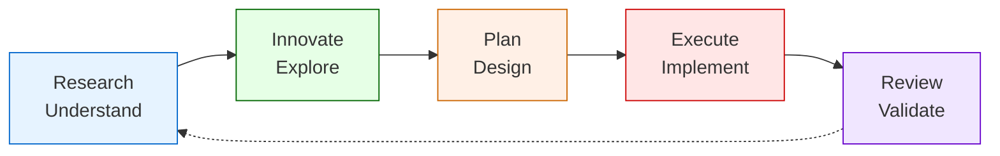
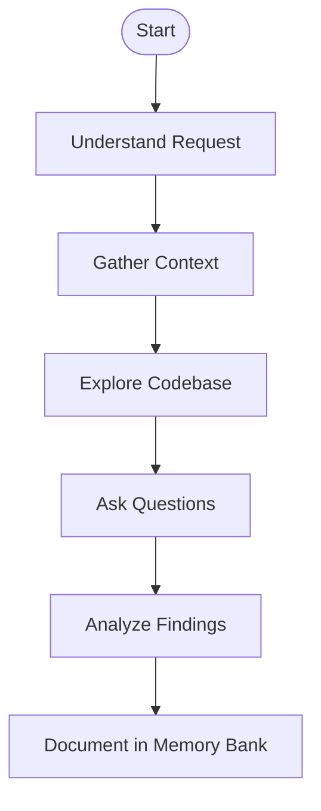
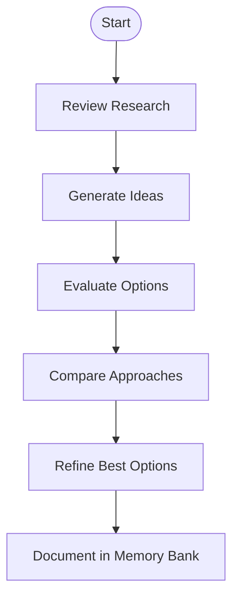
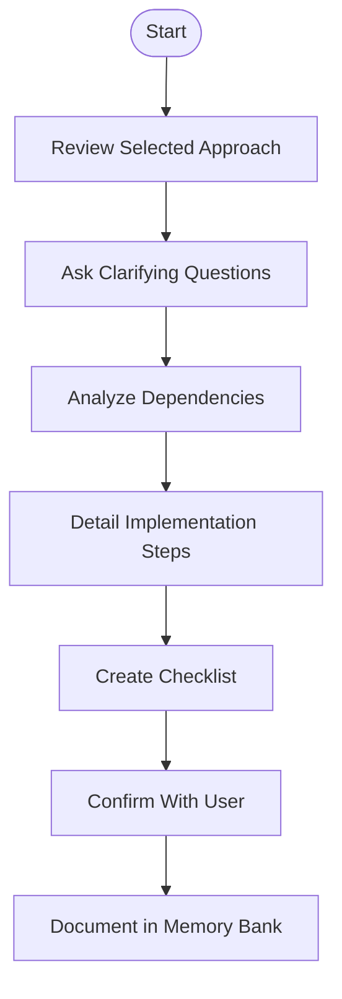
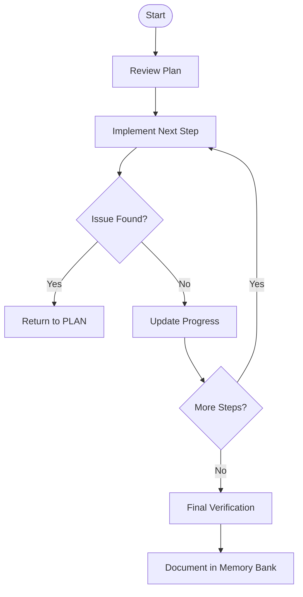
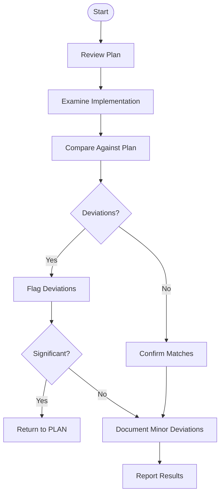
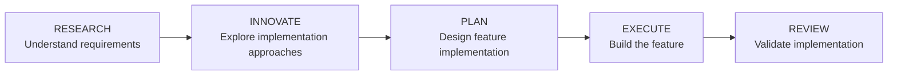
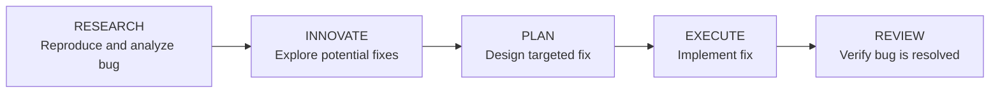
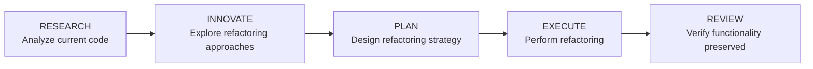
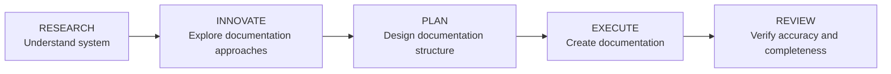

# CursorRIPER Direct - Workflows Guide

This guide provides detailed information on using each mode of the CursorRIPER Direct framework for different development activities.

## Core RIPER Workflow

The RIPER workflow is a systematic approach to software development that guides you through five distinct phases:



## Mode-Specific Workflows

### RESEARCH Mode

**Purpose**: Understand the problem domain and existing code.

**Activation**: `/research` or `ENTER RESEARCH MODE`



**Best Practices**:
- Be specific about what you need to understand
- Reference specific files using @ mentions
- Ask clarifying questions if something is unclear
- Take time to fully understand before moving to solutions

**Example Prompts**:
- "Help me understand how the payment processing system works."
- "I need to understand the data flow in this component."
- "@UserController.js How does authentication work in this file?"
- "What happens when a user submits this form?"

### INNOVATE Mode

**Purpose**: Explore potential solutions and approaches.

**Activation**: `/innovate` or `ENTER INNOVATE MODE`



**Best Practices**:
- Consider multiple approaches rather than focusing on one solution
- Evaluate trade-offs between different options
- Ask "what if" questions to explore alternatives
- Keep options open and avoid committing too early

**Example Prompts**:
- "Let's brainstorm different ways to implement the notification system."
- "What are some approaches to optimize this database query?"
- "Can we explore alternative architectures for this feature?"
- "What are the pros and cons of using a microservice for this?"

### PLAN Mode

**Purpose**: Create detailed implementation specifications.

**Activation**: `/plan` or `ENTER PLAN MODE`



**Best Practices**:
- Answer all clarifying questions thoroughly
- Be specific about implementation details
- Review the plan carefully before approval
- Ensure the plan addresses all requirements
- Consider potential side effects and edge cases

**Example Prompts**:
- "Create a detailed plan for implementing the shopping cart feature."
- "Let's develop a step-by-step plan for refactoring this component."
- "Plan the implementation of the API endpoints for user management."
- "Create an implementation checklist for the authentication system."

**Plan Checklist Format**:
```
IMPLEMENTATION CHECKLIST:
1. [Specific action 1]
2. [Specific action 2]
...
n. [Final action]
```

### EXECUTE Mode

**Purpose**: Implement the approved plan.

**Activation**: `/execute` or `ENTER EXECUTE MODE`



**Best Practices**:
- Only enter EXECUTE mode after a plan is approved
- Follow the plan exactly as outlined
- Track progress against the checklist
- Return to PLAN mode if issues arise
- Test implementation as you go

**Example Prompts**:
- "Let's implement the shopping cart feature according to our plan."
- "Implement steps 1-3 from our plan."
- "Continue implementing the plan from step 4."
- "I've made changes to step 2, please continue with step 3."

### REVIEW Mode

**Purpose**: Validate implementation against the plan.

**Activation**: `/review` or `ENTER REVIEW MODE`



**Best Practices**:
- Compare implementation against each item in the plan
- Flag any deviations, no matter how minor
- Assess the significance of deviations
- Document the review findings
- Decide whether to address deviations or accept them

**Example Prompts**:
- "Review the shopping cart implementation against our plan."
- "Check if the implementation of steps 1-5 matches our plan."
- "Validate that the authentication system was implemented as planned."
- "Review the code changes to ensure they match what we planned."

## Workflow Adaptations

The RIPER workflow can be adapted to different types of development activities:

### Feature Development



**Key Focus Areas**:
- RESEARCH: Understand requirements and user needs
- INNOVATE: Consider various implementation approaches
- PLAN: Create comprehensive implementation plan
- EXECUTE: Build feature components systematically
- REVIEW: Ensure feature meets requirements

### Bug Fixing



**Key Focus Areas**:
- RESEARCH: Reproduce bug and understand root cause
- INNOVATE: Explore different approaches to fix
- PLAN: Create minimal, targeted fix strategy
- EXECUTE: Implement fix carefully
- REVIEW: Verify bug is resolved and no new issues introduced

### Refactoring



**Key Focus Areas**:
- RESEARCH: Understand existing implementation and pain points
- INNOVATE: Consider different refactoring approaches
- PLAN: Create step-by-step refactoring strategy
- EXECUTE: Refactor with careful testing
- REVIEW: Ensure functionality is preserved

### Documentation



**Key Focus Areas**:
- RESEARCH: Understand system components and behavior
- INNOVATE: Consider different documentation formats and styles
- PLAN: Create documentation outline and structure
- EXECUTE: Write clear, concise documentation
- REVIEW: Verify accuracy and completeness

## Memory Bank Integration

Each workflow phase should update specific memory files:

- **RESEARCH updates**:
  - `architecture.md` with system understanding
  - `notes.md` with new insights
  
- **INNOVATE updates**:
  - `architecture.md` with design alternatives
  - `notes.md` with exploration findings
  
- **PLAN updates**:
  - `progress.md` with planned tasks
  - `notes.md` with implementation plans
  
- **EXECUTE updates**:
  - `progress.md` with task status
  - `architecture.md` with implemented decisions
  
- **REVIEW updates**:
  - `progress.md` with completion status
  - `notes.md` with review findings

## Tips for Effective Workflows

1. **Move Flexibly**: Don't feel locked into a strict sequence; adapt as needed
2. **Document as You Go**: Update memory files throughout the process
3. **Balance Detail**: Only document what will be useful later
4. **Use Visual Tools**: Leverage diagrams and formatting for clarity
5. **Iterate Quickly**: Smaller cycles through RIPER are often more efficient

---

*CursorRIPER Direct: Minimal framework, maximum productivity.*
