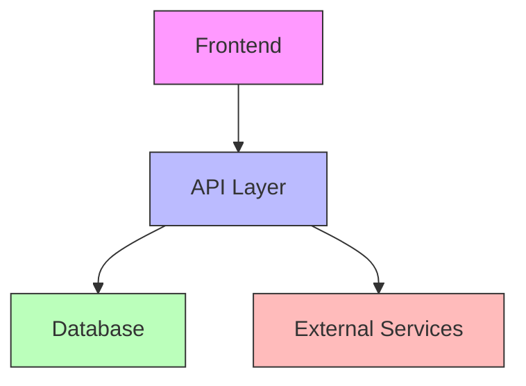

# Architecture: [PROJECT_NAME]
*Created: [CURRENT_DATE]*
*Updated: [CURRENT_DATE]*

## Technology Stack
- **Language**: [Primary programming language]
- **Frontend**: [Frontend framework/library]
- **Backend**: [Backend framework/platform]
- **Database**: [Database technology]
- **Deployment**: [Hosting/deployment approach]

## System Components

## Component Details
### [Component 1]
- **Purpose**: [What this component does]
- **Key features**: [Important functionality]
- **Technologies**: [Specific technologies used]

### [Component 2]
- **Purpose**: [What this component does]
- **Key features**: [Important functionality]
- **Technologies**: [Specific technologies used]

## Data Flow
[Brief description of how data flows through the system]

## Key Technical Decisions
- **[Decision 1]**: [Rationale for this decision]
- **[Decision 2]**: [Rationale for this decision]
- **[Decision 3]**: [Rationale for this decision]

## Security Considerations
- [Security approach 1]
- [Security approach 2]

---

*This document captures technical decisions and system structure.*