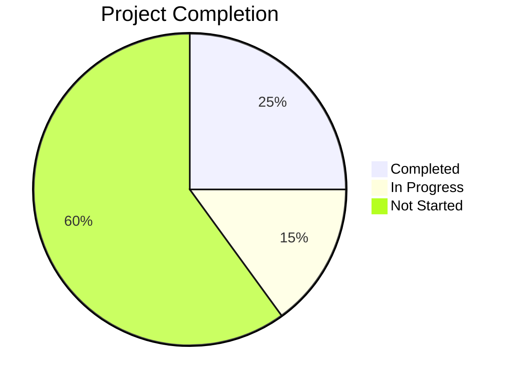

# Progress: [PROJECT_NAME]
*Created: [CURRENT_DATE]*
*Updated: [CURRENT_DATE]*

## Project Status

## Current Focus
[Description of what we're currently working on]

## Recently Completed
- ✅ [Task 1] - [Completion date]
- ✅ [Task 2] - [Completion date]

## In Progress
- 🔄 [Task 3] - [Progress percentage]% - [Notes]
- 🔄 [Task 4] - [Progress percentage]% - [Notes]

## Up Next
- ⏳ [Task 5] - [Priority: High/Medium/Low]
- ⏳ [Task 6] - [Priority: High/Medium/Low]

## Issues
- 🔴 [Critical Issue] - [Impact] - [Status]
- 🟡 [Medium Issue] - [Impact] - [Status]
- 🟢 [Minor Issue] - [Impact] - [Status]

## Milestones
- 🏁 [Milestone 1] - [Due date] - [Status]
- 🏁 [Milestone 2] - [Due date] - [Status]

## Sprint/Cycle Progress
- **Current Sprint**: [Sprint name/number]
- **Sprint Goal**: [Main objective]
- **Sprint Completion**: [Percentage]%

---

*This document tracks development progress and task status.*